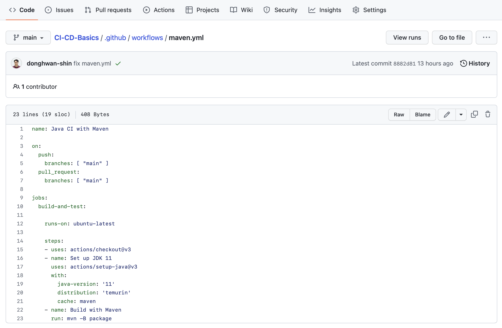
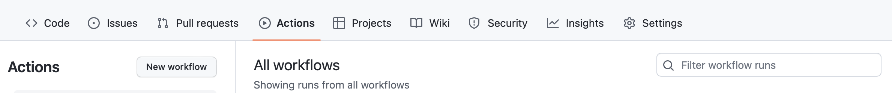
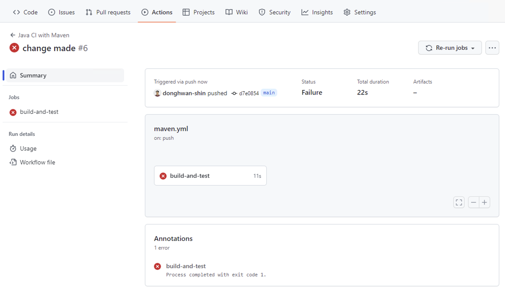
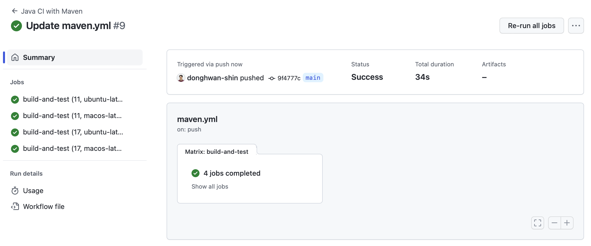

# CI/CD Basics

This repository includes lab materials to support the Spring Semester of the COM3523/6523 module
"Software Reengineering" at the University of Sheffield.

In this week, we explore CI/CD basics.

## Part 1: Set up

This part is to set up your own repository and understand the code in the repository.

#### Step 1: Clone your repository
First, clone this repository to your local machine (e.g., the user drive in the University computer; `u:/Teaching/COM3523/2022-23` in my case). Open `Git Bash` and enter the following commands:

```bash
cd u:/Teaching/COM3523/2022-23
git clone [YOUR_REPOSITORY_ADDRESS]
```

#### Step 2: Take a look at the code
Now, take a look at the code you just cloned.
If you want, open the project in IntelliJ and browse the files in it.
For those who wants to install IntelliJ 2022 on your shared drive (/U:), please refer to [this guideline](install-intellij-user-drive.md).


Basically, the code base has only three files:
- `src/main/java/example/project/Main.java`: a class including a simple main function.
- `src/test/java/example/project/TestMain.java`: a class including a simple test case for the main function.
- `pom.xml`: a maven configuration file.

Open each of the files and understand their functionalities.

#### Step 3: Run maven command on your local machine
Try the following command in a terminal (Git Bash) to see if the project passes build and test as expected:
```bash
mvn package
```
It should not return any errors at this stage.


## Part 2: GitHub CI/CD

In Part 1, you confirmed that the project builds and tests correctly with the given maven configuration file.
However, you had to manually run the command `mvn package` to confirm this.
Now, we will automate this using GitHub CI/CD pipelines.
This means that, whenever a specific trigger condition is met, the pre-defined workflow will automatically run on the CI/CD pipeline and will tell you if anything went wrong.

#### Step 1: Check workflow
I already made a workflow in the template repository. The workflow is defined in `.github/workflows/maven.yml`. Let's take a look at it.

Notice that the folder `.github` is hidden, so you should use either the IntelliJ browser or an additional parameter to show the hidden folders/files (e.g., `ls -al` in a terminal).

The easiest way to see the workflow file is actually to go to your online GitHub repository. In the web browser (e.g., Edge, Safari, Chrome), enter your repository address and go to the workflow file.



#### Step 2: Check workflow runs history on the web
In fact, thanks to the workflow, you already have a CI/CD pipeline executed! Go to "Actions" tap on the GitHub page. You will see a list of workflow runs history.



#### Step 3: Introduce a change to a legacy system
Now, we are going to introduce a bug intentionally and see if the CI/CD works properly (i.e., detecting the bug automatically for us).

Open `src/main/java/example/project/Main.java`. Modify the printing statement to "Hello Software Reengineering!" from "Hello Reengineering!". You can consider this as a minor update to a legacy software system. Commit and push the change.

#### Step 4: Check the CI/CD result for the change
Upon your push, the workflow will automatically run and return some error message.



If you click the failed job, you can see the detailed log:


From there, especially the line `Failed tests:   example.project.TestMain.testHelloWorld(): expected: <Hello Reengineering!> but was: <Hello Software Reengineering!>`, we can see that the difference between the expected and the actual outcomes.

#### Step 5: Fix the bug

(Task) Please fix the bug by updating `src/test/java/example/project/TestMain.java`, commit and push the bug-fixing change, and confirm if the CI/CD works without any failure.

#### Step 6: Update the workflow to run on a different machine

Currently, the workflow is running on `ubuntu-latest` only. In practice, since the same application should be executable on different machines, including MacOS and Windows, it's important to automatically build and test the application on various machines.

(Task) To check if our code builds and tests correctly on MacOS, update the workflow file and confirm if there are no failures.

HINT: see the references provided at the end of this document.

#### Step 7: Update the workflow to run on different machines using different JDKs

Let's take one step further. In practice, it's quite common that users may have different JDK versions. We want to make sure if our code works well on different machines with different JDKs.

(Task) We want to run the same workflow for different configuration combinations. Specifically, two JDK versions (11 and 17) and two machine types (Ubuntu and MacOS). Update `.github/workflows/maven.yml` to achieve this. In the end, we want to see the following results.



HINT: see the references provided at the end of this document.

## References
- [Understanding GitHub Actions](https://docs.github.com/en/actions/learn-github-actions/understanding-github-actions)
- [Building and testing Java with Maven](https://docs.github.com/en/actions/automating-builds-and-tests/building-and-testing-java-with-maven)
